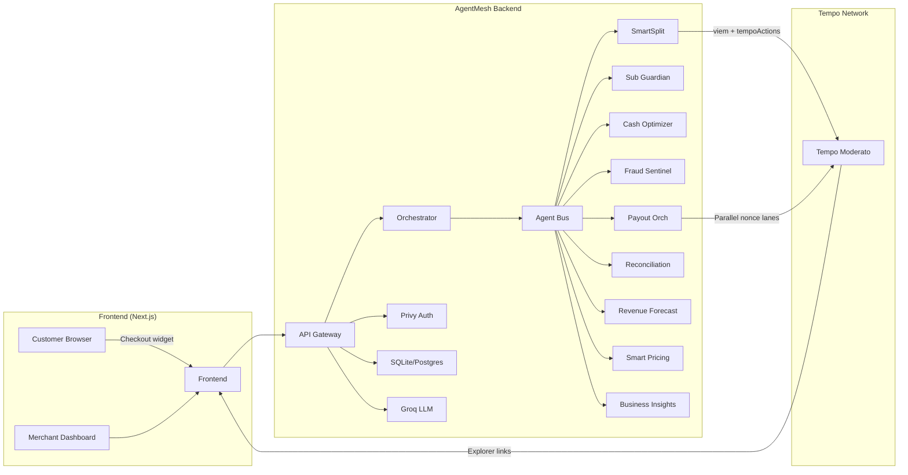
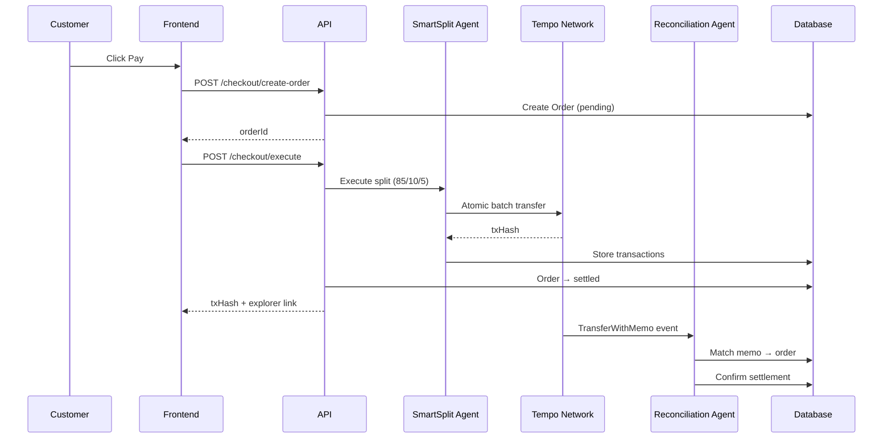

# Modulo Architecture Overview

## System Architecture

## Data Flow

## Agent Architecture

Each agent implements:
- **Event triggers**: HTTP requests, webhooks, scheduled scans
- **Analysis engine**: Algorithmic computation on DB data
- **LLM layer**: Groq-powered strategic narrative generation
- **Health endpoint**: Status, uptime, capabilities

| Agent | Type | Trigger | Groq Model |
|-------|------|---------|------------|
| SmartSplit | Transaction | HTTP (checkout) | — |
| Reconciliation | Settlement | Webhook (events) | — |
| Revenue Forecaster | Analytics | HTTP (API call) | llama-3.3-70b |
| Smart Pricing | Analytics | HTTP (API call) | llama-3.3-70b |
| Cash Optimizer | Treasury | HTTP (API call) | llama-3.3-70b |
| Fraud Sentinel | Security | HTTP (pre-settlement) | llama-3.3-70b |
| Business Insights | Intelligence | HTTP (API call) | llama-3.3-70b |
| Subscription Guardian | Retention | Webhook (failures) | llama-3.3-70b |
| Payout Orchestrator | Bulk ops | HTTP (CSV upload) | llama-3.3-70b |

## Memo Convention

- Order settlements: `order:<orderId>:split:v1`
- Agent-to-agent payments: `agentpay:<agentId>:<invoiceId>`
- Subscription retries: `sub:<userId>:retry<N>`

## Technology Stack

| Layer | Technology |
|-------|-----------|
| Frontend | Next.js 16, React, CSS |
| Auth | Privy (email/phone/wallet) |
| Blockchain | Tempo Moderato (viem, tempoActions) |
| Database | SQLite (dev) / Postgres (prod) via Prisma |
| AI/LLM | Groq (Llama 3.3 70B) |
| Token standard | TIP-20 (AlphaUSD stablecoin) |
